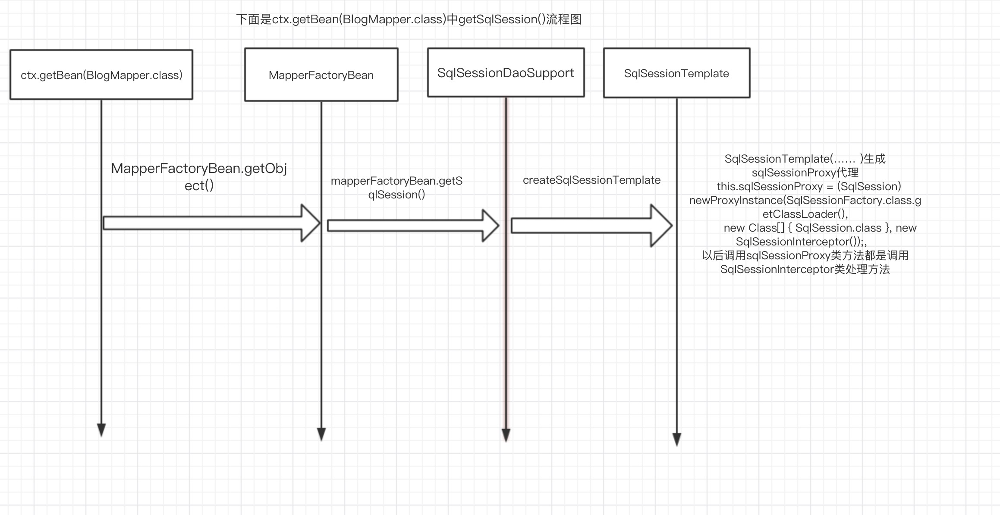
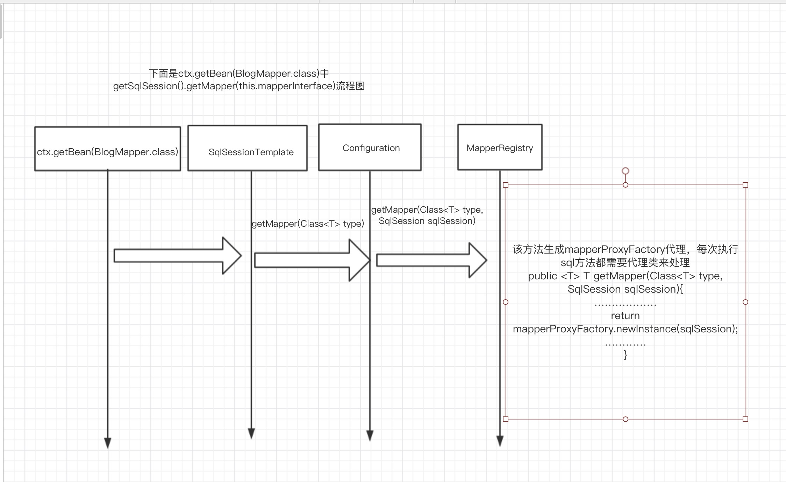

# Mybatis spring plugin详解

## 1.环境

- jdk8
- mybatis3.5.2
- Spring 5.1.9.RELEASE
- spring-jdbc 5.1.9.RELEASE

## 2.官方解释

mybatis允许自定义拦截执行对数据库操作方法，默认mybatis-plugin支持拦截以下方法:

- org.apache.ibatis.executor.Executor中定义（update, query, flushStatements, commit, rollback, getTransaction, close, isClosed）方法
- org.apache.ibatis.executor.parameter.ParameterHandler中定义（getParameterObject, setParameters）方法
- org.apache.ibatis.executor.resultset.ResultSetHandler中定义（handleResultSets, handleOutputParameters）方法
- org.apache.ibatis.executor.statement.StatementHandler中定义 (prepare, parameterize, batch, update, query)方法

以上类中方法通过方法签名进行拦截，要明白覆盖这些方法功能，假如要监控这些方法，需要修改默认方法行为和重写方法功能，增加拦截器可能破坏mybatis核心代码，增加拦截器代码需要小心

##3.plugin配置

###3.1 .plugin代码

```java
@Intercepts({@Signature( type = Executor.class, method = "update",
                args = {MappedStatement.class,Object.class}),
        @Signature(
                type = Executor.class,
                method = "query",
                args = {MappedStatement.class, Object.class, RowBounds.class, ResultHandler.class, CacheKey.class, BoundSql.class}),
            @Signature(type = Executor.class, method = "query",
                args = { MappedStatement.class, Object.class, RowBounds.class, ResultHandler.class }),
            @Signature(type = Executor.class, method = "query",
                args = { MappedStatement.class, Object.class, RowBounds.class, ResultHandler.class, CacheKey.class, BoundSql.class })
})
public class ExamplePlugin implements Interceptor
{
    @Override
    public Object intercept(Invocation invocation) throws Throwable {
        System.out.println("拦截开始====");
        Object returnObject = invocation.proceed();
        System.out.println("拦截结束====");
        return returnObject;
    }

    @Override
    public Object plugin(Object target) {
        return Plugin.wrap(target, this);
    }

    @Override
    public void setProperties(Properties properties) {

    }
}
```

###3.2. spring中配置

```xml
<?xml version="1.0" encoding="UTF-8"?>
<beans 
……………………
    <!-- spring jdbc 数据源配置-->
    <bean id="dataSource" class="org.springframework.jdbc.datasource.DriverManagerDataSource">

        <property name="driverClassName" value="com.mysql.jdbc.Driver" />

        <property name="url" value="jdbc:mysql://localhost:3306/test" />

        <property name="username" value="root" />

        <property name="password" value="123456" />
    </bean>

    <bean id="vendorProperties" class="org.springframework.beans.factory.config.PropertiesFactoryBean">
        <property name="properties">
            <props>
                <prop key="SQL Server">sqlserver</prop>
                <prop key="DB2">db2</prop>
                <prop key="Oracle">oracle</prop>
                <prop key="MySQL">mysql</prop>
            </props>
        </property>
    </bean>

    <bean id="databaseIdProvider" class="org.apache.ibatis.mapping.VendorDatabaseIdProvider">
        <property name="properties" ref="vendorProperties"/>
    </bean>
    <!-- mybatis  SqlSessionFactory配置-->
    <bean id="sqlSessionFactory" class="org.mybatis.spring.SqlSessionFactoryBean">
        <property name="dataSource" ref="dataSource" />
        <!-- 自动扫描路径下xml文件-->
<!--     <property name="mapperLocations" value="classpath*:mapper/*.xml" />-->

        <!-- 自动扫描路径下配置文件-->
        <property name="configLocation" value="classpath:mybatis-config.xml"/>
        <property name="databaseIdProvider" ref="databaseIdProvider"/>
        <property name="plugins">
            <array>
                <bean class="com.zzm.intercept.ExamplePlugin"/>
            </array>
        </property>
    </bean>

    <!-- mapper 配置-->
    <bean id="mpperFactoryBean" class="org.mybatis.spring.mapper.MapperFactoryBean">
        <property name="mapperInterface" value="com.zzm.dao.BlogMapper" />
        <property name="sqlSessionFactory" ref="sqlSessionFactory" />
    </bean>

</beans>
```

3.3.测试代码

```java
public class MbatisSpringTest
{
    public static void main( String[] args )
    {
        ApplicationContext ctx = new ClassPathXmlApplicationContext("application.xml");
        BlogMapper blogMapper = ctx.getBean(BlogMapper.class);
//        blogMapper.selectBlog(1);

        blogMapper.containsKey("ttt");
    }
}
```

### 3.4.plugin源码分析

#### 3.4.1自定义配置plugin初始化代码片段如下：

org.mybatis.spring.SqlSessionFactoryBean#buildSqlSessionFactory

```java

  protected SqlSessionFactory buildSqlSessionFactory() throws Exception {

    final Configuration targetConfiguration;

    …………………………
	//此处代码增加自定义plugin到config中
    if (!isEmpty(this.plugins)) {
      Stream.of(this.plugins).forEach(plugin -> {
        targetConfiguration.addInterceptor(plugin);
        LOGGER.debug(() -> "Registered plugin: '" + plugin + "'");
      });
    }
………………

    return this.sqlSessionFactoryBuilder.build(targetConfiguration);
  }


```

## 4.plugin执行流程






下面两张图是一起，03图后续流程04图接着，一张图放不下，所以分开